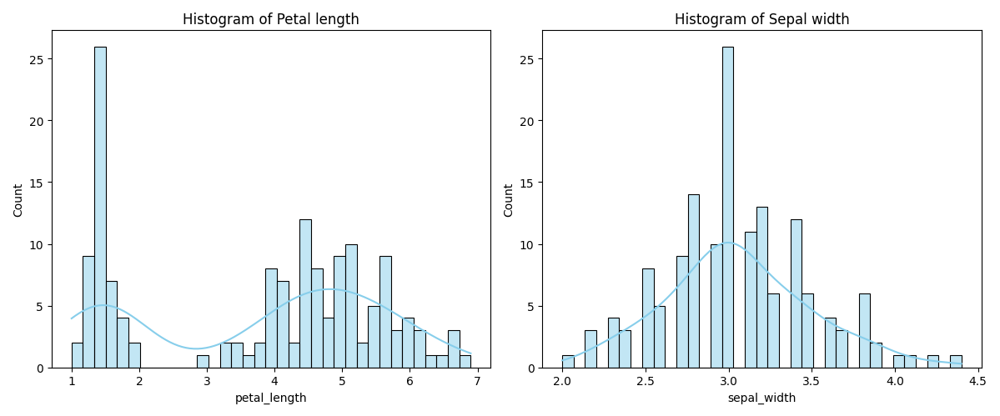
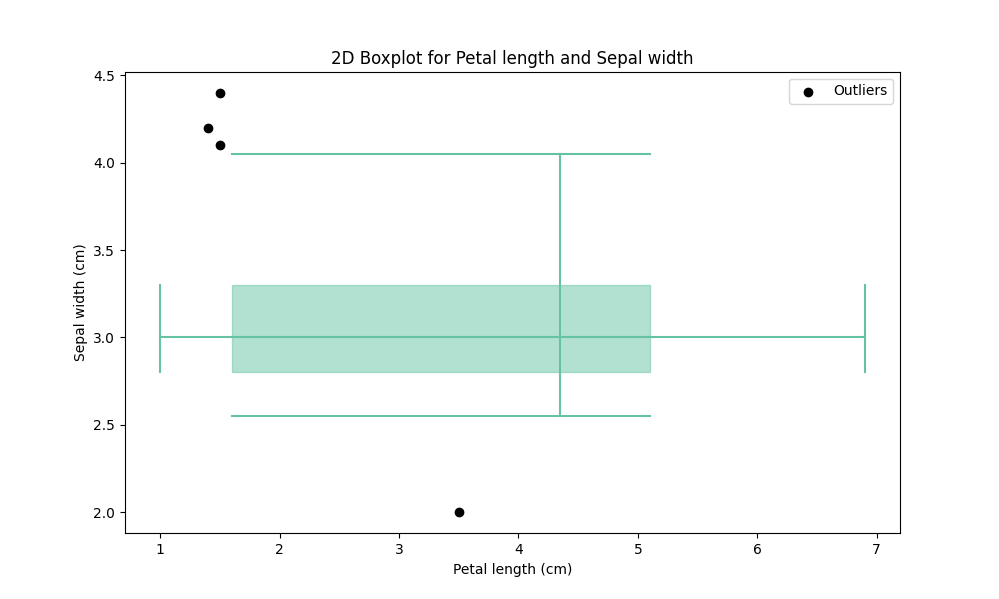
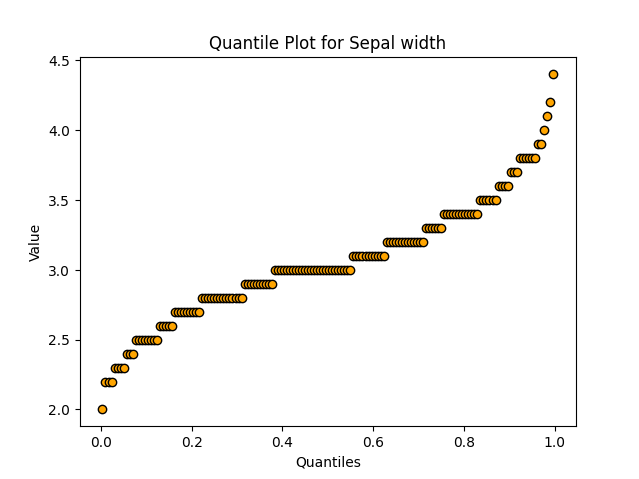
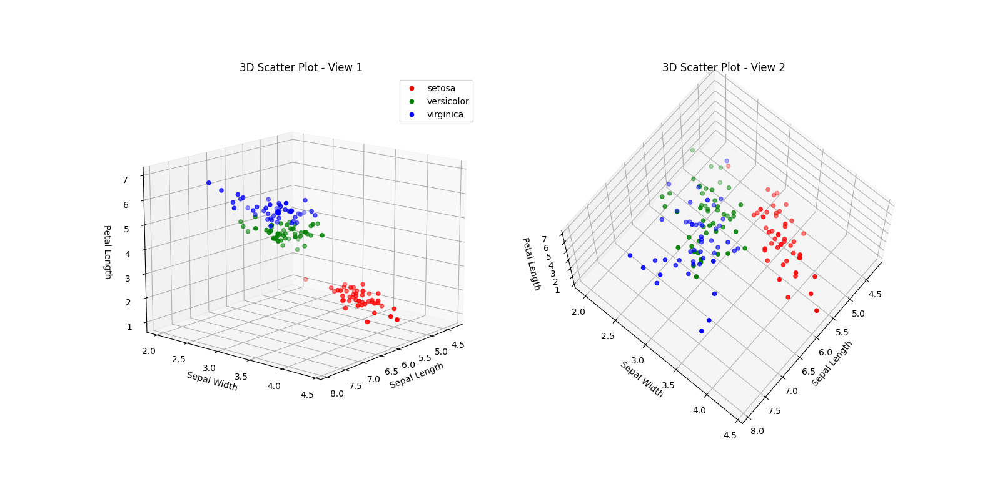

# Iris Dataset: Comprehensive EDA & Visualization


A comprehensive exploratory data analysis (EDA) of the classic Iris dataset, implemented in Python.

This project performs a deep dive into the dataset's characteristics by calculating detailed statistics, analyzing feature correlations, and generating a wide array of static and 3D visualizations to understand feature distributions and class separability.

---

## 📊 Key Analyses & Visualizations

This project is structured into three main analysis scripts found in the `src/` directory:

* **Univariate Summary Statistics (`USS.py`):**
    * Calculates 14 different summary statistics (including mean, median, quartiles ($Q_1, Q_3$), IQR, std, MAD, and percentiles) for the 'sepal width' of each species.
    * The final results are exported to `dist/statistics.csv`.

* **Correlation Analysis (`CA.py`):**
    * Computes the Pearson correlation matrix for all four numerical features.
    * Identifies and prints the feature pairs with the minimum and maximum absolute correlation.
    * The correlation matrix is exported to `dist/correlations.csv`.

* **Comprehensive Visualization (`Visualization.py`):**
    * **Label Distribution:** A bar plot to check for class balance.
      

    * **Histograms:** 2D histograms for `petal_length` and `sepal_width`, and a 3D histogram combining `petal_length` and `sepal_length`.
      
      

    * **Box Plots:** Generates per-species 1D box plots and a consolidated 2D box plot.
      
      

    * **Quantile Plots:** Created to analyze the distribution and quantiles of `petal_length` and `sepal_width`.
      
      

    * **Scatter Plots:** Includes a 6-plot matrix for all feature pairs and an interactive 3D scatter plot (`sepal_length`, `sepal_width`, `petal_length`).
      
      

    * **Probability Density:** Plots the Kernel Density Estimation (KDE) for `petal_length`, grouped by species, to visualize class overlap.
      
---

## 🛠️ Technologies Used

* **Python**
* **Pandas:** For data loading, manipulation, and statistical calculations.
* **NumPy:** For numerical operations and data structuring.
* **Scikit-learn:** Used to load the built-in Iris dataset.
* **Matplotlib:** For creating the base plots and 3D visualizations.
* **Seaborn:** For advanced statistical visualizations (histograms, box plots, scatter plots).
* **SciPy:** Used for Kernel Density Estimation (`gaussian_kde`).

---

## 📂 Repository Structure

```
Iris-Dataset-EDA/
│
├── .gitignore          # Ignores files like __pycache__
├── README.md           # This file
├── requirements.txt    # Python dependencies
│
├── dist/               # Output directory for generated files
│   ├── correlations.csv  # Generated correlation matrix
│   └── statistics.csv    # Generated univariate statistics
│
└── src/                # Source code directory
    ├── CA.py             # Script for Correlation Analysis
    ├── USS.py            # Script for Univariate Summary Statistics
    ├── Visualization.py  # Script for all plot generation
    └── run.py            # Main script to run all analyses
```

---

## 🚀 How to Run

1.  **Clone the repository:**
    ```bash
    git clone [https://github.com/AlieShayan/Iris-Dataset-EDA.git](https://github.com/AlieShayan/Iris-Dataset-EDA.git)
    cd Iris-Dataset-EDA
    ```

2.  **Create and activate a virtual environment:**
    ```bash
    python -m venv venv
    source venv/bin/activate  # On Windows: .\venv\Scripts\activate
    ```

3.  **Install the dependencies:**
    ```bash
    pip install -r requirements.txt
    ```

4.  **Run the analysis:**
    The main script `run.py` will execute all other scripts (`CA.py`, `USS.py`, `Visualization.py`) in order.
    ```bash
    python src/run.py
    ```

5.  **Check the output:**
    * All visualizations will be displayed on-screen as the script runs.
    * The `dist/` folder will be populated with the updated `statistics.csv` and `correlations.csv` files.
